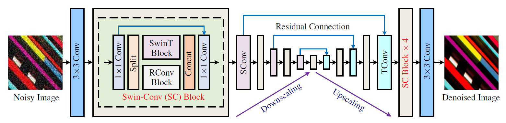

# _DENOISING_OF_IMAGES_USING_SCU-NET_ARCHITECTURE


__*The following results are obtained by our SCUNet with purely synthetic training data! 
We did not use the paired noisy/clean data by DND and SIDD during training!*__
<p align="left">
  <a href="https://github.com/cszn/SCUNet">
    
    
    
    
  </a>
</p>

<p align="left">
  <a href="https://github.com/cszn/SCUNet">
    
    
    
    
  </a>
</p>


Swin-Conv-UNet (SCUNet) denoising network
----------
 


*Schematic illustration of the proposed paired training patches synthesis pipeline. For a high quality image, a randomly shuffled
degradation sequence is performed to produce a noisy image. Meanwhile, the resizing and reverse-forward tone mapping are performed
to produce a corresponding clean image. A paired noisy/clean training patches are then cropped for training deep blind denoising model.
Note that, since Poisson noise is signal-dependent, the dashed arrow for “Poisson” means the clean image is used to generate the Poisson
noise. To tackle with the color shift issue, the dashed arrow for “Camera Sensor” means the reverse-forward tone mapping is performed on
the clean image.*
 

*Synthesized noisy/clean patch pairs via our proposed training data synthesis pipeline. The size of the high quality image patch is
544×544. The size of the noisy/clean patches is 128×128.*


Web Demo
---------
Try Replicate web demo for SCUNet models here [](https://replicate.com/cszn/scunet)

Codes
---------
1. Download SCUNet models
```python
python main_download_pretrained_models.py --models "SCUNet" --model_dir "model_zoo"
```

2. Gaussian denoising
    1. grayscale images

    ```bash
    python main_test_scunet_gray_gaussian.py --model_name scunet_gray_25 --noise_level_img 25 --testset_name set12
    ```

    2. color images
    ```bash
    python main_test_scunet_color_gaussian.py --model_name scunet_color_25 --noise_level_img 25 --testset_name bsd68
    ```
3. Blind real image denoising

    ```bash
    python main_test_scunet_real_application.py --model_name scunet_color_real_psnr --testset_name real3
    ```


